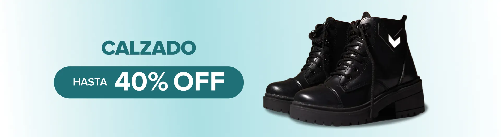
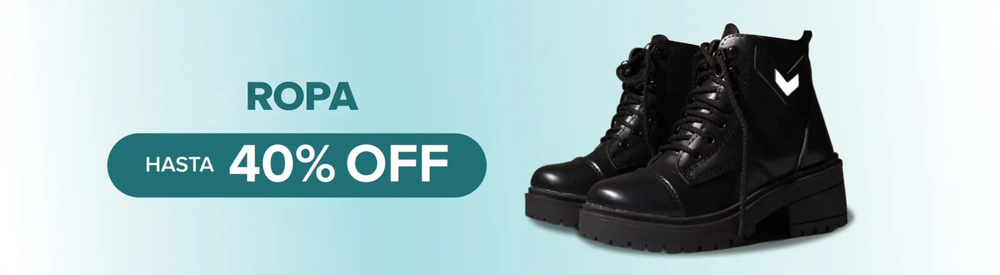

# Why Use the FLUX Model with Extended Mask and Reference Image Capabilities

## 1. Introduction

Image editing using text prompts has advanced significantly with models like **FLUX**. However, in tasks that require high precision—such as editing banners for e-commerce—it's crucial to preserve the position and integrity of existing elements. 

This document explores how using **FLUX with support for mask and reference images** enhances control, accuracy, and consistency during the editing process. For more information on this check this reference : [FLUX with Mask and Reference Images (Pull Request)](https://github.com/huggingface/diffusers/pull/11820)

You can experiment with these extended capabilities by exploring the accompanying notebook:  
📄 [exp_flux_extended.ipynb](exp_flux_extended.ipynb)

## 2. The Problem: Object Drift and Scene Alteration

By default, the FLUX model can edit objects and text using only prompt-based input. However, through experimentation, we've observed that FLUX may unintentionally alter object positioning or slightly change surrounding content—even when only a specific element (like text or a jacket) is meant to be edited.

### Example 1: Editing Without Masks or References

Let's start with the following base image:

We attempt to replace the text "CALZADO" with "ROPA" using only a prompt:

**Observation:** The text is changed correctly, but the black jacket in the image is also unintentionally modified. This drift in visual elements is problematic when editing banners where layout consistency is key.

## 3. The Solution: Using Mask and Reference Images

FLUX's extended capabilities now allow the use of **mask images** (to localize edits) and **reference images** (to preserve context and structure). These features help maintain all other elements in the image unchanged while precisely editing only the masked area.

### Example 2: Editing Using a Mask

Here is the original base image:

We define a mask to isolate only the text region for editing:

Using FLUX with the mask image, we generate the edited image:

**Observation:** The text has been updated from "CALZADO" to "ROPA", and **all other elements remain unchanged**

## 4. Conclusion

In tasks where spatial consistency and visual integrity matter—such as e-commerce banners—editing with masks and references provides greater control, reliability, and precision. FLUX with these extended features is a powerful solution for targeted, non-destructive image edits.

## 5. References

* [FLUX with Mask and Reference Images (Pull Request)](https://github.com/huggingface/diffusers/pull/11820)
* [FLUX Model GitHub Repository](https://github.com/black-forest-labs/flux)
* [FLUX.1-Fill-dev Model (used in ACE Plus)](https://huggingface.co/black-forest-labs/FLUX.1-Fill-dev)
* [Flux Kontext Documentation – Image Editing](https://github.com/black-forest-labs/flux/blob/main/docs/image-editing.md)
